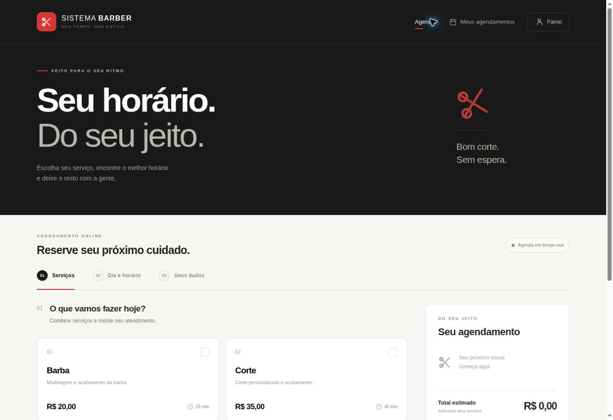

# Sistema Barber

Sistema real de agendamento com frontend HTML/CSS/JavaScript modular, PostgreSQL e Edge Functions do Supabase. A interface é construída com Vite; não há dados simulados na aplicação.

## Projetos

- Site: https://teste-gpt-autonomo.vercel.app/
- Painel: https://teste-gpt-autonomo.vercel.app/admin.html
- GitHub: https://github.com/nicolaskirschner79-byte/TESTE-GPT-AUTONOMO.
- Supabase: `hvsqlrqegjbjqspaqcsc` (`GPT-AUTONOMO`).
- Vercel: `prj_U4oFw0xv6IJ5ABtGE4RzvAugc8IT` (`teste-gpt-autonomo`).



## Implementação

- Cliente: seleção múltipla de serviços, barbeiro, data e horário; nome e celular; resumo; comprovante; histórico no dispositivo; cancelamento e reagendamento.
- Horários: duração acumulada, almoço, bloqueios, fechamento, folgas, datas especiais e validação no servidor. A restrição GiST impede sobreposição no banco; os locks por barbeiro sincronizam reserva e bloqueios.
- Proprietário: login com Supabase Auth, recuperação de senha, agenda em lista/calendário, filtros, agendamento manual, confirmação, ausência, conclusão com pagamento, estorno, despesas, profissionais, serviços, feriados e bloqueios.
- Financeiro: receita prevista, recebida, despesas, lucro, ticket médio e serviços concluídos. Reserva não é pagamento. Cancelamento não apaga recebimentos. Estornos são registros separados.
- WhatsApp: fila persistente, processamento imediato após operações, cron a cada minuto, templates oficiais, webhook assinado, estados do provedor e tentativas progressivas. Sem credenciais a fila permanece pendente.

## Executar

Node.js 24 e npm. As versões estão fixadas no `package-lock.json`.

```bash
npm ci
cp .env.example .env.local
# Preencher somente a chave pública/publishable do projeto.
npm run dev
npm run build
npm test
```

`VITE_SUPABASE_URL` e `VITE_SUPABASE_PUBLISHABLE_KEY` são públicas. Nunca coloque `service_role`, segredo do Supabase, senha ou token do WhatsApp em uma variável `VITE_*`.

## Estrutura

```text
index.html                         Agendamento e histórico do dispositivo
admin.html                         Painel e autenticação do proprietário
src/client.js                      Fluxos dos clientes
src/admin.js                       Gestão e financeiro
src/agenda-model.js                Datas, filtros, linha do tempo e disponibilidade
src/agenda-view.js                 Agenda diária/semanal e próximo cliente
src/agenda-controller.js           Navegação e ações rápidas da agenda
src/api.js                         API, identidade do dispositivo e Realtime
src/utils.js                       Telefone, datas, apresentação e indicadores
src/ui.js                          Componentes e diálogos
src/styles.css                     Página pública e estilos compartilhados
src/admin.css                      Painel e login
supabase/migrations/               Schema, RPCs restritas e agendador da fila
supabase/functions/barber-api/     Validação, identidade e autorização
supabase/functions/whatsapp-worker/Processador autenticado da fila
supabase/functions/whatsapp-webhook/Validação HMAC e estados de entrega
supabase/functions/_shared/        Cliente de servidor e templates
tests/                            Testes de banco, API e apresentação
docs/                             Configuração e evidências de testes
```

## Banco e segurança

As migrations deste repositório já foram aplicadas no projeto Supabase indicado acima. Não reaplique a migration inicial manualmente nesse projeto. Em outro projeto, ajuste a referência e a URL do worker antes de aplicar via `supabase db push`.

O schema `barber_private` contém clientes, contatos, reservas, itens históricos, horários, pagamentos, despesas, notificações, consentimentos e auditoria. Ele não é exposto pela Data API. Todas as tabelas têm RLS. Somente a Edge Function com chave de servidor pode executar `barber_rpc`, `barber_queue` e o limitador.

O catálogo público contém apenas nomes, serviços, preços e perfis públicos. `availability_signal` contém apenas uma versão e a data de alteração. O Realtime envia esse sinal para o navegador, que consulta novamente a disponibilidade. Dados pessoais não entram na publicação Realtime.

Clientes usam uma chave aleatória de 256 bits salva no dispositivo, equivalente a uma identidade persistente. O servidor armazena apenas seu hash. Não há consulta por telefone. Clientes só leem e alteram reservas vinculadas à própria chave. Apagar o armazenamento do navegador remove o acesso local, mas mantém as reservas administrativas. Essa chave deve ser tratada como uma credencial; não a envie a outras pessoas.

Reserva, cancelamento e reagendamento são transacionais. Preços, nomes e durações são fotografados em `booking_items`. Idempotência por UUID impede a duplicação de confirmação. Há limite de requisições por origem e cinco reservas futuras por dispositivo.

## Criar o acesso do proprietário

1. Em Supabase **Authentication → URL Configuration**, configure o Site URL como `https://teste-gpt-autonomo.vercel.app` e adicione `https://teste-gpt-autonomo.vercel.app/admin.html` às Redirect URLs. Para desenvolvimento, adicione `http://localhost:5173/admin.html` e/ou `http://127.0.0.1:5173/admin.html`.
2. Mantenha a confirmação de e-mail ativada no provedor Email. Ela faz parte da autorização do proprietário.
3. Crie ou convide a conta `nicolaskirschner79@gmail.com` diretamente no Supabase Authentication. Defina uma senha com pelo menos 12 caracteres pelo fluxo seguro e confirme o e-mail.
4. Abra `/admin.html` e entre com a conta do proprietário. A página oferece login e recuperação de senha; o cadastro foi removido da interface.
5. O trigger associa ao papel administrativo somente o usuário cujo e-mail verificado é `nicolaskirschner79@gmail.com`.

O cadastro de barbeiros cria somente perfis profissionais. Ele não cria usuários nem concede acesso ao painel. O servidor verifica a sessão com `getUser()` e valida o papel pelo identificador do usuário em cada operação administrativa.

Se o usuário já existir, use **Esqueci minha senha**. O frontend nunca contém uma senha inicial. O envio e recebimento do e-mail de confirmação/recuperação dependem do serviço de e-mail do projeto e não foram testados com a caixa postal do proprietário. A integração Supabase usada nesta sessão não expõe a configuração das URLs de Auth; o acesso ao dashboard ficou na tela de login. Esse ajuste ainda precisa ser conferido antes do primeiro acesso.

## Funcionamento inicial

Segunda a sábado, 09:00–19:00, almoço 12:00–13:00; domingo fechado. Um profissional inicial (Nicolas), celular de notificações `5515996855412`. Inícios a cada 60 minutos, respeitando a duração acumulada dos serviços.

| Serviço | Valor | Duração provisória |
|---|---:|---:|
| Corte | R$35 | 40 min |
| Sobrancelha | R$5 | 10 min |
| Barba | R$20 | 25 min |
| Luzes | R$110 | 120 min |

As durações são provisórias e devem ser ajustadas no painel. Luzes, por exemplo, não cabe às 11:00 antes do almoço nem às 18:00 antes de fechar. Feriados precisam ser cadastrados conforme as datas de fechamento da barbearia; o sistema não assume um calendário externo.

## WhatsApp

Consulte [docs/whatsapp.md](docs/whatsapp.md). É necessário ter um remetente oficial, token, Phone Number ID e templates aprovados pela Meta. Para receber avisos no WhatsApp do barbeiro, o destinatário precisa ser diferente do remetente. Os lembretes aos clientes podem usar o número do barbeiro como remetente. Nenhuma credencial foi recebida e nenhum envio real de WhatsApp foi feito durante a implementação.

## Publicação e futuras atualizações

O repositório está vinculado ao projeto Vercel informado. O commit `31637073dc7d2e3e534c58950c046521ba91b632` na branch `main` gerou automaticamente o deployment de produção `dpl_5HoNcRi1mcXqm5FxukN3koiR4ht1`, com estado READY. Framework Vite, Node 24, instalação `npm ci`, build `npm run build` e saída `dist` estão configurados. As duas variáveis públicas estão registradas em development, preview e production.

O endereço principal respondeu HTTP 200 a uma requisição sem cookies nem autenticação e foi testado no navegador. A proteção SSO existente foi preservada. Não foi necessário removê-la para acessar o endereço principal. O painel exige sessão do Supabase e papel administrativo, mesmo com a página pública acessível.

Novos commits na branch `main` acionam a publicação do frontend. Migrations e Edge Functions precisam ser aplicadas/publicadas no Supabase além do commit; não são implantadas somente por um build na Vercel. As integrações autorizadas no ChatGPT permitem executar essas etapas conforme a solicitação, enquanto as conexões estiverem disponíveis.

## Verificação

- `npm test`: telefone, fuso horário, cálculos financeiros e escape de HTML.
- `tests/hero.test.mjs` e `tests/hero.sql`: destaque da landing page, validação das opções, alterações parciais e políticas de upload. O teste SQL reverte seus dados temporários.
- `tests/agenda.test.mjs` e `tests/agenda.sql`: visão diária/semanal, horários livres, início do atendimento, conclusão e autorização. O teste SQL reverte todos os fixtures. Veja [docs/agenda-test-report.md](docs/agenda-test-report.md).
- `tests/database.sql`: testes transacionais com rollback do fixture. Execute com privilégios de teste no SQL Editor.
- `node tests/remote-integration.mjs`: disputa simultânea pela API real, histórico, cancelamento, reagendamento, privacidade, Realtime e autenticação dos workers. Esse teste cria reservas de QA temporárias e registra os IDs em `test-results/cleanup.json`; remova apenas esses fixtures depois.
- [docs/test-report.md](docs/test-report.md): resultados efetivamente executados e limites da validação.

As chaves do Supabase não devem ser alteradas sem atualizar o ambiente da aplicação. Backups, SMTP e credenciais do WhatsApp pertencem às respectivas contas e devem ser configurados conforme o uso real.

## Personalização visual

No painel, abra **Configurações → Identidade visual**. É possível alterar o nome da barbearia, a frase da marca, a logo, as cores principal/cabeçalho/fundo e a fonte, com prévia antes de salvar. A mesma configuração é aplicada ao agendamento, histórico, login, painel, título da aba e favicon.

As preferências são salvas no Supabase, e o sinal Realtime existente atualiza a marca nos navegadores abertos. Rascunhos do formulário não são apagados pela sincronização automática. **Restaurar cores e fonte** retorna a paleta e a tipografia padrão, preservando nome e logo.

Logos aceitam PNG, JPG e WebP de até 2 MB. O bucket `barber-branding` permite leitura pública dessas imagens; inserção e remoção exigem o proprietário verificado e sua pasta pessoal. Os arquivos usam nomes únicos, sem sobrescrita. As preferências privadas e as credenciais não são expostas ao cliente.

A migração `20261005171851_visual_identity.sql` foi aplicada ao projeto conectado. Os testes específicos estão em `tests/branding.test.mjs` e `tests/branding.sql`; os dados temporários de SQL são revertidos.

## Destaque da página inicial

Em **Configurações → Destaque da página inicial**, escolha **Minha imagem** para enviar PNG, JPG ou WebP de até 5 MB. Os formatos disponíveis são arredondado, círculo, moldura e orgânico. O enquadramento pode priorizar o centro, o topo ou a parte de baixo da foto. A prévia aparece antes de salvar.

**Artes do sistema** oferece tesoura clássica, barber pole e monograma com as iniciais da barbearia. As duas linhas do texto também são editáveis, com até 60 caracteres cada; deixe-as vazias para exibir apenas a imagem ou a arte. Alternar para uma arte pronta preserva a foto salva para uso posterior. **Remover imagem** remove a foto da configuração ao salvar; **Voltar ao destaque padrão** retorna à tesoura e aos textos originais.

O destaque é salvo no Supabase e atualizado nos navegadores pelo Realtime existente. Salvar a identidade visual preserva o destaque; salvar o destaque preserva nome, logo, cores, fonte e regras da agenda. Os rascunhos de ambos os formulários são preservados durante a sincronização.

O bucket público `barber-hero` armazena as imagens de destaque. Somente o proprietário verificado pode enviar, listar e remover arquivos em sua pasta `images/{user_id}`; clientes podem visualizar as imagens publicadas. A migração `20261005185058_hero_highlight.sql` foi aplicada no projeto conectado.

## Agenda do barbeiro

Em **Agendamentos**, escolha **Dia** ou **Semana**. O calendário alinha os atendimentos pela hora: uma coluna por profissional no dia e sete colunas na semana. Use Hoje, as setas, a data, a busca e os filtros de status/profissional. A grade tem rolagem com cabeçalhos fixos; a posição é preservada durante a sincronização.

**Confirmado em verde**, a confirmar em amarelo, em atendimento em azul, concluído em roxo, cancelado em vermelho e ausência em cinza. Os cartões mostram horário, nome e serviço, com legenda e texto acessível. Reservas que se sobrepõem na visualização recebem faixas distintas, inclusive cancelamentos e atendimentos de profissionais diferentes.

Clique no atendimento para consultar os detalhes e usar Confirmar, Iniciar, Concluir/pagamento, ausência, lembrete, cancelamento e reagendamento. Os cartões de contadores e o painel lateral foram substituídos por um resumo curto. O atendimento em curso permanece acessível mesmo fora do período selecionado.

Os atalhos + oferecem somente vagas consultadas no Supabase e aparecem inicialmente; o botão Horários livres permite ocultá-los. Cada reserva ocupa exatamente 1 hora, independentemente da previsão de duração ou da quantidade de serviços. Almoço, bloqueios, folgas e horários especiais vêm dos dados reais. As datas usam `America/Sao_Paulo`. A migração `20261005202020_daily_agenda.sql` permanece aplicada; o redesenho não exige outra migration.

## Correções da avaliação

Os indicadores diários e o gráfico dos últimos sete dias usam uma consulta independente do período financeiro. As rotas públicas são atualizadas em todas as transições e acompanham Voltar/Avançar. O rodapé direciona para os horários reais, sem informar um expediente fixo. Requisições têm timeout de 15 segundos sem repetir automaticamente operações.

Em **Notificações** e **Configurações**, o proprietário vê a situação do WhatsApp e os itens faltantes sem expor credenciais. A API bloqueia novos lembretes sem configuração de envio. A conexão da Meta pode ser validada e salva em **Configurações → Conectar WhatsApp**, com o token criptografado no Vault. O worker gera e envia automaticamente os lembretes 30 minutos antes, com consentimento e sem duplicar o mesmo horário. A autorização da conta e a aprovação do modelo na Meta ainda precisam ser concluídas pelo proprietário. A organização está no plano Free e o aviso sobre proteção contra senhas vazadas continua pendente de um recurso de plano pago.

Consulte [docs/corrections.md](docs/corrections.md) para resultados e limites dos testes, e [docs/site-audit.md](docs/site-audit.md) para a avaliação original. `tests/system-audit.sql` usa fixtures isolados com rollback para verificar cadastros, reservas, disponibilidade e operações financeiras.

## Reservas fixas de uma hora

A migração `20261006223000_fixed_hour_appointments.sql` está aplicada. Criação pública, agendamento manual e reagendamento reservam 60 minutos. A previsão de duração de cada serviço permanece no catálogo, mas não bloqueia horários adicionais. O almoço, feriados, bloqueios e reservas existentes continuam indisponíveis. Os botões exibem intervalos completos, por exemplo **10:00–11:00** e **13:00–14:00**.

As seis reservas que ocupavam a agenda de hoje em diante foram normalizadas sem modificar início, serviços, preços ou pagamentos. Registros anteriores ao dia da atualização mantêm o histórico. A regra é imposta por trigger no banco, inclusive para reagendar uma reserva antiga. Veja [a correção e a verificação](docs/fixed-hour-appointments.md).

## Lembretes automáticos

O cron do Supabase roda a cada minuto e envia lembretes de 30 minutos mesmo com o painel fechado. Conecte uma conta real em **Configurações → Conectar WhatsApp**. O modelo de aviso ao barbeiro é opcional; a conexão de lembretes não depende dele. Consulte [docs/whatsapp.md](docs/whatsapp.md) para requisitos e limites. `npm test` inclui um Postgres isolado em memória (PGlite), que executa a migration de lembretes e valida fila, mudanças de reserva, permissões e webhook sem tocar nos registros de produção nem enviar mensagens externas.
